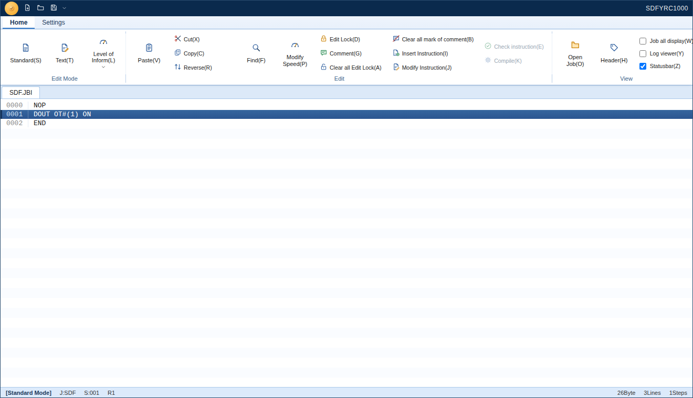
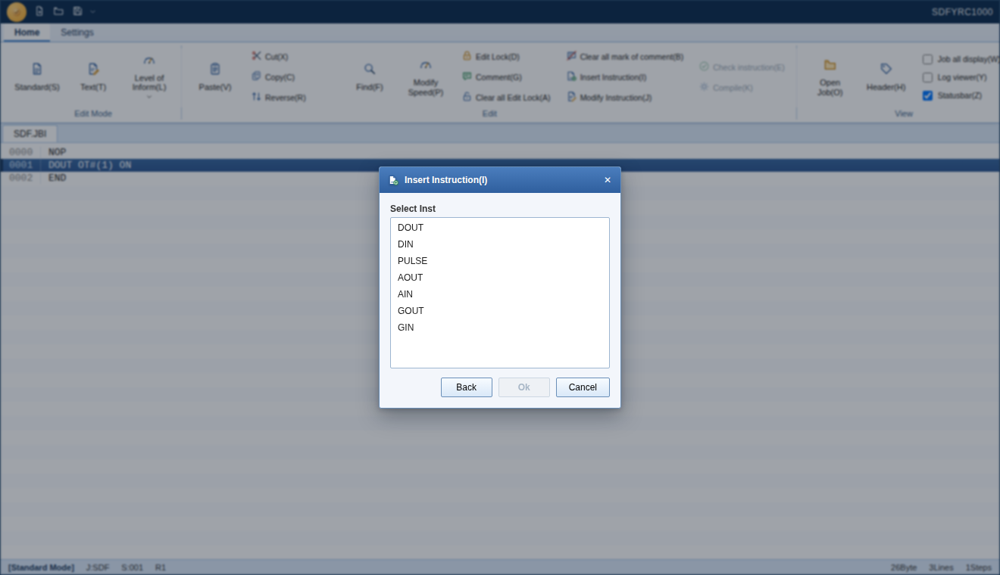
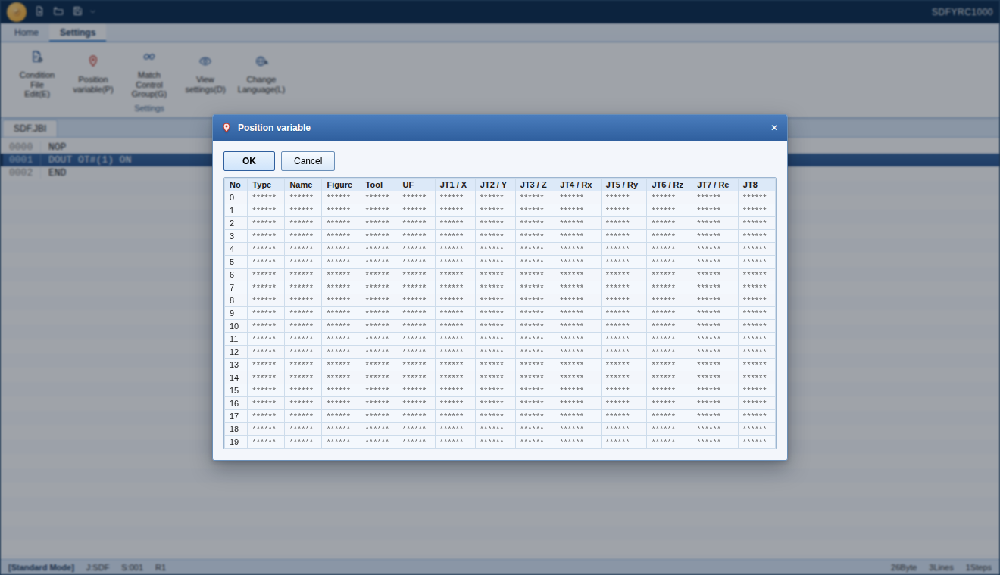

# YRC1000 Job Editor

A free, open-source desktop clone of the Yaskawa Motoman **JEDIT/YRC1000** job editor ribbon UI, built with **Electron + React + TypeScript**.

> **Unofficial, independent project.** This is a from-scratch recreation of the editor's user interface, written for interoperability and educational purposes. It is not affiliated with, endorsed by, or built from the source code of Yaskawa Electric Corporation. "YRC1000" and "Motoman" are trademarks of their respective owner.



## Features

- **Ribbon interface** (Home / Settings tabs) matching the original layout — Edit Mode, Edit, View, and Settings groups, with a custom SVG icon set
- **Job editor** line list (`NOP` / `DOUT` / `END`-style instructions) with line selection, edit-lock (`X0001`) and comment (`//`) marks
- **Inline line-edit bar** docked at the bottom of the main window (not a modal) for inserting/modifying an instruction, with an Edit button that drills into the structured field editor — mirrors the original app's interaction model
- **Text Mode** — freeform textarea editing of the instruction body (one instruction per line, `//` comments), an optional read-only header preview via "Job all display", and Check instruction/Compile syntax validation reported through a Log viewer panel with click-to-jump errors
- **Real `.JBI` file open/save** via native OS dialogs — reads and writes the job's name, comment, control group, date, and local variable counts, preserving the `//POS` block and any header lines it doesn't model yet so round-tripping a file never silently drops data
- **Backstage menu** — Create Job, Select Job, Save, Save As, Delete Job, Batch Change Folder Name, Print, Recent files
- **Dialogs**: Find and Jump, Insert/Modify Instruction (category → instruction → detail), Header of Job, Create Job, Modify Speed, Position Variable, Match Control Group → Select Group → Select, Display Setting (General/Color), Select Language

<p float="left">
  
  
</p>

## Status

The visual shell, editing flows, and real `.JBI` file I/O are in place. Still on the roadmap:

- [ ] `ALL.PRM` parameter file parsing — we only check that one exists next to the job (and warn if it doesn't, matching the original); its actual binary/text layout isn't publicly documented, so its contents (instruction sets, aliases, control group options, ...) aren't read
- [ ] Text Mode autocomplete/input support (the original suggests instruction/tag candidates as you type)
- [ ] Condition file editing (`IONAME.DAT` / `VARNAME.DAT`), macro commands, expression editor
- [ ] Position-variable editing (the `//POS` block round-trips untouched but isn't parsed into the Position Variable dialog yet)

> The on-disk format support here is best-effort, reverse-engineered from the editor's own UI — it isn't verified against the vendor's exact byte-for-byte format. Back up real job files before saving over them.

## Tech stack

- [Electron](https://www.electronjs.org/) — desktop shell
- [React 19](https://react.dev/) + [TypeScript](https://www.typescriptlang.org/)
- [Vite](https://vite.dev/) + [vite-plugin-electron](https://github.com/electron-vite/vite-plugin-electron)
- Hand-rolled SVG icon set, no UI framework dependency

## Getting started

```bash
npm install
npm run dev      # Vite + Electron dev mode
```

Other scripts:

```bash
npm run build    # type-check + build renderer and electron bundles
npm run package  # build and package with electron-builder
npm run lint     # oxlint
```

## Project structure

```
electron/            main process + preload script
src/
  components/
    Ribbon/           ribbon tabs, groups, buttons, dropdown
    JobEditor/         line list + tabs
    TitleBar/          orb menu button + quick access
    StatusBar/
    Modal/             shared modal shell
    Toast/             save/open success/error notifications
    LineEditBar/        inline insert/modify instruction bar
    TextModeEditor/      freeform Text Mode textarea + gutter
    LogViewer/           Check instruction/Compile results
    dialogs/           every dialog (Find, Insert Instruction, Header, ...)
    icons/             the SVG icon set
  data/
    jbiFormat.ts        .JBI text parser/serializer
    jobFileIO.ts         open/save flows over the Electron bridge
    textMode.ts          Text Mode content <-> lines + syntax check
    mockJob.ts, instructions.ts
  state/              reducer-based app store
  types/              job/header/instruction types, window.jobEditor bridge
```

## License

[MIT](LICENSE)
